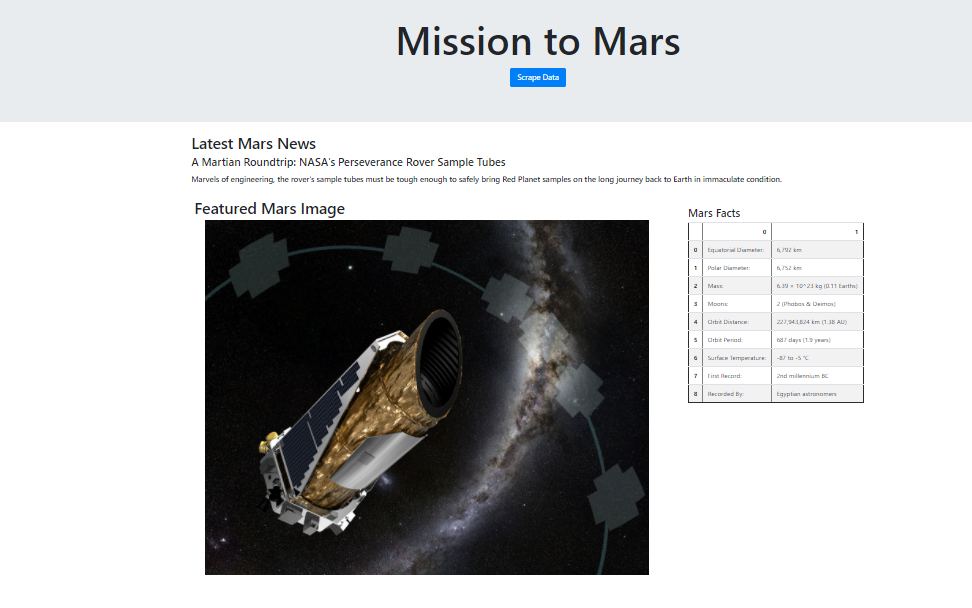
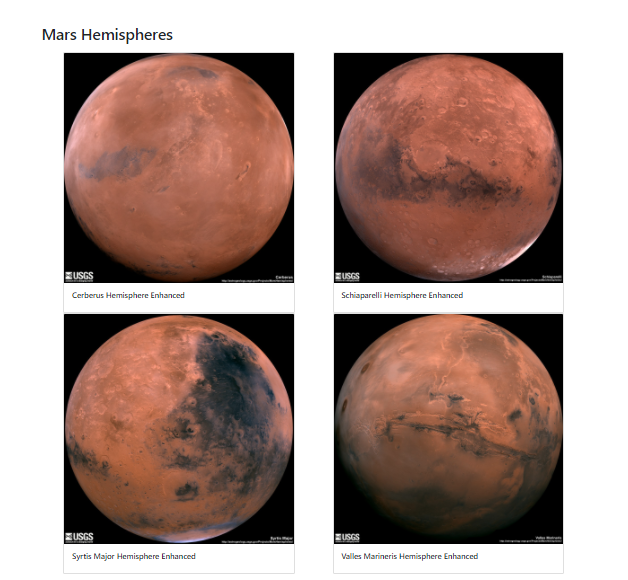

# web-scraping-challenge

In this assignment, I built a web application that scrapes various websites for data related to the Mission to Mars and displays the information in a single HTML page. 

I scraped data from four websites:
<ul>
<li> https://mars.nasa.gov/news/?page=0&per_page=40&order=publish_date+desc%2Ccreated_at+desc&search=&category=19%2C165%2C184%2C204&blank_scope=Latest </li>
<li> https://www.jpl.nasa.gov/spaceimages/?search=&category=Mars </li>
<li> https://space-facts.com/mars/ </li>
<li> https://astrogeology.usgs.gov/search/results?q=hemisphere+enhanced&k1=target&v1=Mars</li>
 </ul>
  
  
And the final application displays the data as such:

